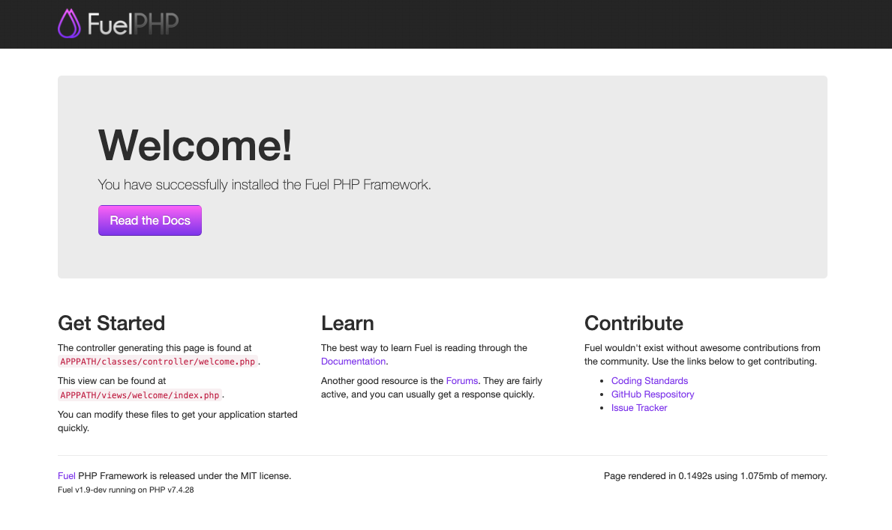

# 目的

* FuelPHPのローカル環境を構築して簡単なApiを作成する

## ドキュメント

https://fuelphp.com/docs/

## 環境構築

```sh
$ docker compose build --no-cache && docker compose up -d
$ yes | docker compose exec php composer install
$ docker compose exec php php oil r install
```



## テスト

### リクエストパラメータ

```sh
# DBデータをjson形式で取得
$ curl http://localhost:9999/api/test/read | jq
# DBにデータを登録
$ curl -H "multipart/form-data" \
-F "password=test" \
-F "username=test" \
http://localhost:9999/api/test/write
```

### テスト用コンテナ

```sh
$ dokcer image pull debian:11-slim
 2203022c5aa9: Pull complete 
 Digest: sha256:78fd65998de7a59a001d792fe2d3a6d2ea25b6f3f068e5c84881250373577414
 Status: Downloaded newer image for debian:11-slim
 docker.io/library/debian:11-slim
$ docker container run --privileged -itd -p 1919:80 --name test_debian --init debian:11-slim
 c1d733530f102e95646780ea19e083d75a0311021119a75d5a4672afd8c8fda3
$ docker container ls
 CONTAINER ID   IMAGE            COMMAND   CREATED              STATUS              PORTS                  NAMES
 c1d733530f10   debian:11-slim   "bash"    About a minute ago   Up About a minute   0.0.0.0:1919->80/tcp   test_debian
$ docker container exec -it test_debian bash
 root@c1d733530f10:/# ls
 bin  boot  dev	etc  home  lib	media  mnt  opt  proc  root  run  sbin	srv  sys  tmp  usr  var
```